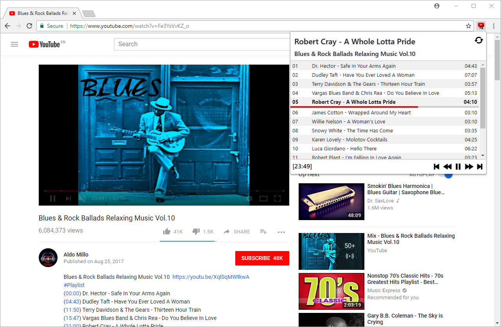

# YouTube™ Tracklist Control
MIT-licensed open source extension for Google Chrome, Firefox and Chromium.  

This extension provides useful functionalities when watching music-compilation videos on YouTube™.  

This extension builds its own interactive tracklist by scanning for timestamped tracks in the video description or comments.  

The tracklist can be displayed from any tab and controlled via configurable global keyboard shortcuts (defaults are the keyboard's media buttons).

## Features
- Media control (play, pause, rewind, fast-forward, previous track, next track)
- Tracklist building from the video description or comments
- Tracklist navigation
- Progress bar on current song
- Support of keyboard media keys (configurable global keyboard shortcuts)
- Cross-tab interactivity (view and control the tracklist from any tab)

## Installation
From extension stores:
- [Chrome Web store](https://chrome.google.com/webstore/detail/youtube-compilation-helpe/acdincmjdbdcndnidcmajippglnbplhk)
- [Firefox Add-ons store](https://addons.mozilla.org/en/firefox/addon/youtube-tracklist-control/)

From source:
- For Chrome/Chromium:
  + download the source
  + open the extension tab (URI: `chrome://extensions/`)
  + click the "Load unpacked extension" button
  + select the project's folder
- For Firefox:
  + download the source from the `firefox_version` branch
  + open the add-on debugging tab (URI: `about:debugging`)
  + click the "Load Temporary Add-on" button
  + select a zip archive of the project
